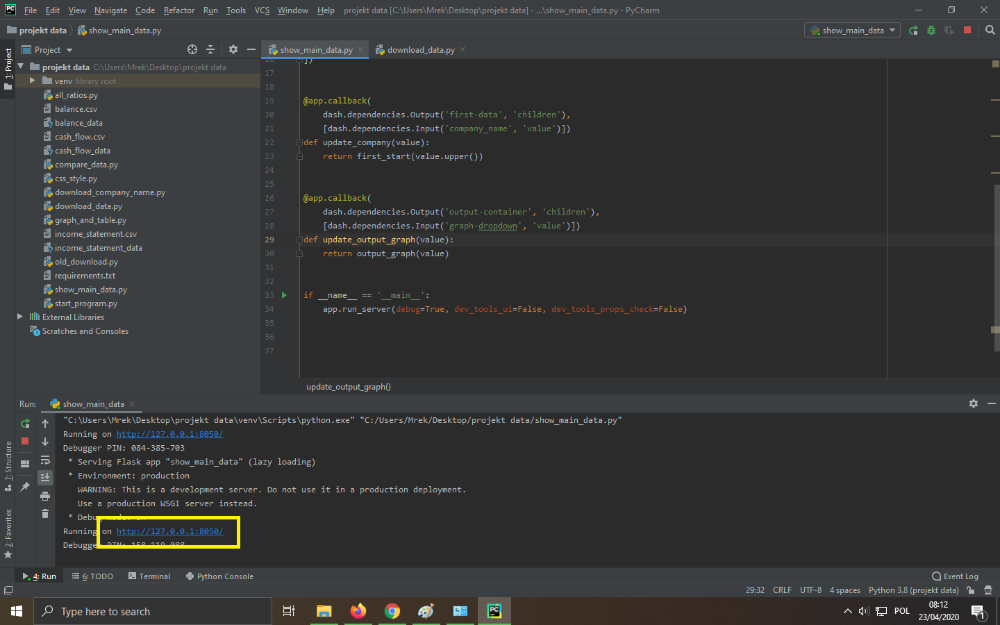
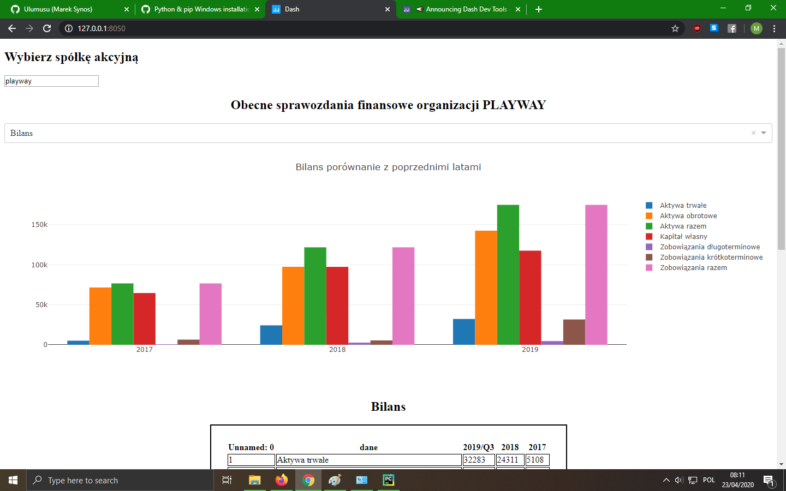
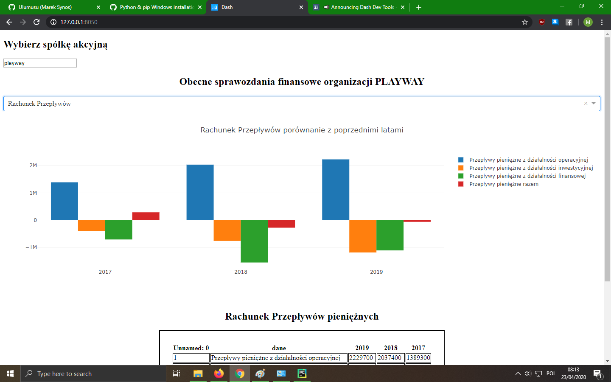

# financial-analysis-project-in-python
This app calculate basic ratios and show on graphic plots some elements from Financial Statements for every company from polish stock market. I used Dash framework and Pandas.

# How to run??

1. Use git clone or download manually.
2. install all frameworks and librares from requirements.txt

    >pip3 install -r requirements.txt
    
    or 
    
    >pip install -r requirements.txt
    
    if you set pip3 like default option
    
3. Run project (show_main_data.py)
4. Copy adress and paste to browser

# Project images

